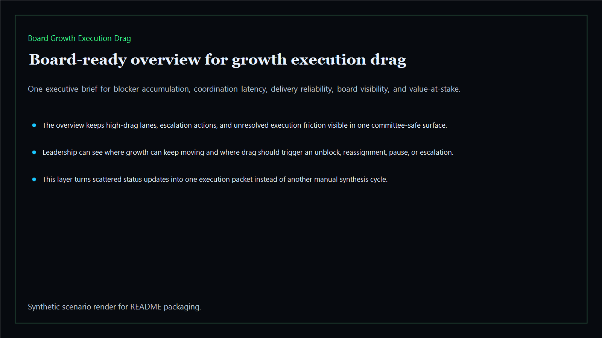
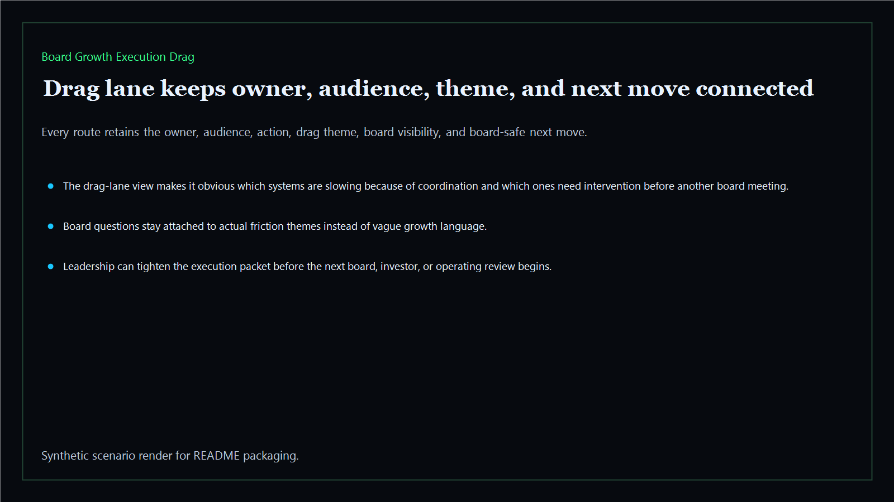
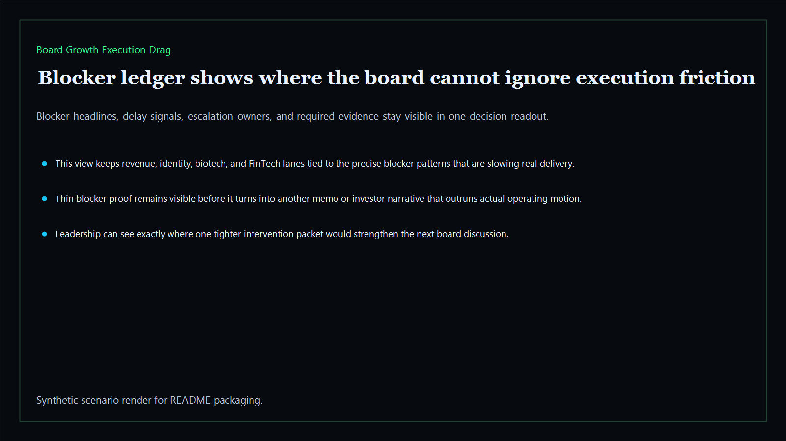
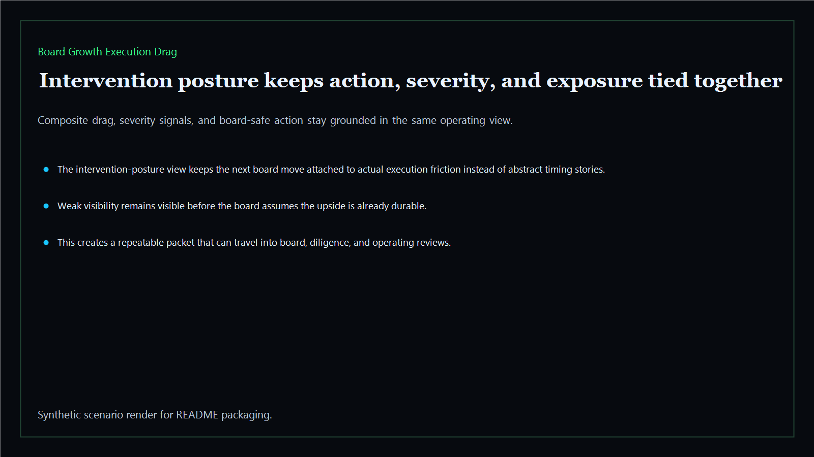

# Board Growth Execution Drag

Board-ready growth execution drag surface for delivery friction, cross-functional blockers, operating latency, and board-visible drag across the executive estate.

- Live: `https://drag.kineticgain.com/`
- Repo: `mizcausevic-dev/board-growth-execution-drag`

## Why this matters

Leaders need more than a growth plan. They need one surface that shows where execution drag, coordination latency, and blocker accumulation are eroding the upside before the board funds the next step.

## What it includes

- TypeScript executive-intelligence surface for growth execution drag with modeled blocker lanes, delay signals, operating friction, and board-safe intervention posture
- synthetic executive lanes across AI, identity, revenue, FinTech, biotech, procurement, and public-sector readiness
- reusable outputs for drag briefs, blocker ledgers, intervention packets, and board-ready execution memos
- prerendered static site, JSON payloads, screenshots, and docs

## Routes

- `/`
- `/drag-lane`
- `/blocker-ledger`
- `/intervention-posture`
- `/verification`
- `/docs`

## Local run

```bash
cd board-growth-execution-drag
npm install
npm run verify
npm run prerender
npm run render:assets
```

## CLI

```bash
npx board-growth-execution-drag fixtures/board-growth-execution-drag.json --format summary
npx board-growth-execution-drag fixtures/board-growth-execution-drag-clean.json --format json
```

## Docs

- [Architecture](docs/architecture.md)
- [Origin](docs/ORIGIN.md)
- [Kinetic Gain Embedded](docs/KINETIC_GAIN_EMBEDDED.md)

## Screenshots





